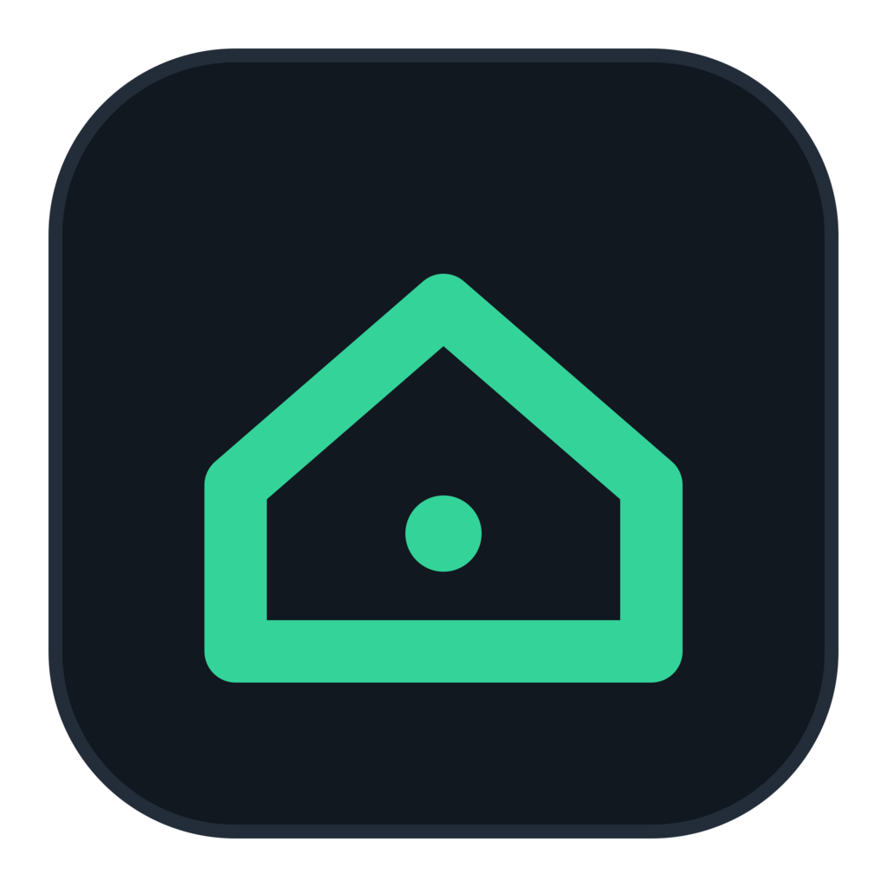

<p align="center">
  
</p>

<h1 align="center">Homebase</h1>

<p align="center"><b>Turn an old laptop into a control panel for every device in your home.</b></p>

That slow laptop in the drawer still has a screen, a keyboard and a battery. Homebase turns it into a quiet little terminal for your home network: it finds what's connected, shows what's on and what's off, and lets you jump into any of it with one click. No cloud, no account, nothing leaves your network.

## What it does

- 🔎 **Finds your devices on its own.** Within seconds it lists what's on your network and works out what each thing is: "Office PC · Windows", "raspberrypi · Raspberry Pi OS", "Smart TV". Pick the ones you care about and press Add.

- 🟢 **Knows what's on.** Every device shows whether it's up, how fast it answers, and how long it's been running. A device that just dozes off on Wi-Fi isn't mistaken for one that's switched off.

- 💻 **A terminal built in.** Open an SSH session to a Raspberry Pi or any Linux box right inside the app. If something's wrong (wrong user, a freshly reinstalled device, SSH still booting) it tells you in plain words and offers the fix.

- 🖥️ **Remote desktop in one click.** Connect to a Windows PC through RustDesk, or wake it up over the network when it's off.

- 📺 **Your TV, from the couch.** Volume and play / pause / seek for anything playing over DLNA, even on old budget smart TVs.

- 🌐 **Internet at a glance.** A live line of your connection's response time sits in the top bar, and you hear about it when the internet drops and when it's back.

- 🔔 **A history that makes sense.** Devices turning on and off, outages, and unknown devices joining your network all land in one timeline, with desktop notifications for the ones that matter.

- 🪶 **Light on old hardware.** Built for a 2-core Celeron with 4 GB of RAM: the background service uses well under 1% of a CPU core.

## Why it exists

Home networks quietly fill up with things: a PC, a Raspberry Pi, a TV, a laptop that isn't yours. Keeping an eye on them usually means a router page nobody understands, three different apps, and typing IP addresses from memory. Homebase puts all of it on one screen, on hardware you already own.

## Install

Homebase runs on Linux. The background service is plain Python 3 (standard library only); the window is a small [Tauri](https://tauri.app) app.

```sh
# 1. The background service, started with your session
cp linux/homebase.service ~/.config/systemd/user/   # adjust the path inside if the project isn't in ~/Projects/homebase-app
systemctl --user enable --now homebase.service

# 2. The app window (needs Rust and Node.js)
npm install
npm run build
cp src-tauri/target/release/homebase ~/.local/bin/
cp linux/homebase.desktop ~/.local/share/applications/
install -Dm644 src-tauri/icons/128x128.png ~/.local/share/icons/hicolor/128x128/apps/homebase.png
```

The panel also works in any browser at <http://127.0.0.1:8800>. Optional extras: `ptyxis` for opening SSH in a separate window, the RustDesk Flatpak for remote desktop, and `iw` for Wi-Fi signal strength.

## License

Homebase is source-available under the [PolyForm Noncommercial License 1.0.0](LICENSE.md): you're welcome to read the code, learn from it, and use it for personal, hobby, or educational purposes, but any commercial use is not permitted.
